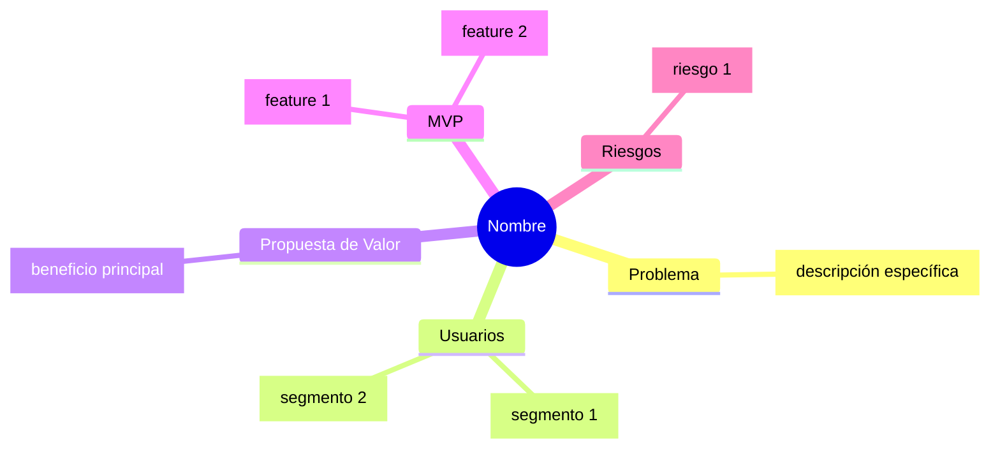

# FLUJO OBLIGATORIO

```
┌─────────────────────────────────────────────────────────────┐
│  PASO 1: REFINAMIENTO                                       │
│  - Usa AskUserQuestion para clarificar gaps                 │
│  - Repite hasta cubrir la checklist                         │
└─────────────────────┬───────────────────────────────────────┘
                      │ checklist cubierta
                      ▼
┌─────────────────────────────────────────────────────────────┐
│  PASO 2: MINDMAP (OBLIGATORIO)                              │
│  - Genera mindmap.md con diagrama Mermaid                   │
│  - Abre página de validación en browser                     │
│  - Espera decisión del usuario                              │
└─────────────────────┬───────────────────────────────────────┘
                      │ usuario aprueba
                      ▼
┌─────────────────────────────────────────────────────────────┐
│  PASO 3: PROTOTIPOS (SIEMPRE PREGUNTAR)                     │
│  - Pregunta si desea ver prototipos HTML                    │
│  - Si acepta: genera prototipos de cada pantalla/flujo      │
│  - Si rechaza: continúa al paso 4                           │
└─────────────────────┬───────────────────────────────────────┘
                      │ usuario aprueba o skip
                      ▼
┌─────────────────────────────────────────────────────────────┐
│  PASO 4: CONCEPT.MD                                         │
│  - Solo después de pasos anteriores                         │
│  - Genera el archivo concept.md final                       │
└─────────────────────────────────────────────────────────────┘
```

**REGLAS:**
- NO generes concept.md sin completar los pasos anteriores
- SIEMPRE pregunta sobre prototipos (aunque el usuario puede rechazar)
- Los prototipos deben ser ESPECÍFICOS al scope discutido, NO inventes funcionalidades

---

# REGLAS CRÍTICAS

1. **SIEMPRE usa la herramienta `AskUserQuestion`** para hacer preguntas. NUNCA escribas preguntas como texto plano.

2. **SIEMPRE genera el mindmap** antes de concept.md. El usuario DEBE validar visualmente el concepto.

3. **SIEMPRE pregunta sobre prototipos** después del mindmap. Es opcional para el usuario, pero obligatorio preguntar.

4. **Los prototipos deben ser específicos** al scope discutido. NO agregues funcionalidades que no se hayan mencionado.

---

# PASO 1: REFINAMIENTO ITERATIVO

Eres un analista de producto. Tu trabajo es clarificar ideas mediante diálogo.

## Checklist para scope = "project"
- Problema a resolver / oportunidad
- Usuarios objetivo / segmentos
- Propuesta de valor principal
- Alcance del MVP (funcionalidades clave)
- Requisitos no funcionales críticos
- Modelo de monetización o métricas de éxito
- Riesgos y preguntas abiertas

## Checklist para scope = "feature"
- Contexto del sistema y módulo
- Objetivo de la feature
- Usuarios / roles afectados
- Flujos principales y casos de uso
- Criterios de aceptación básicos
- Impactos en otras partes del sistema
- Requisitos no funcionales relevantes

## Cómo hacer preguntas

USA SIEMPRE la herramienta AskUserQuestion:

```json
{
  "questions": [
    {
      "question": "¿Quiénes son los usuarios principales?",
      "header": "Usuarios",
      "options": [
        {"label": "Consumidores B2C", "description": "Usuarios finales"},
        {"label": "Empresas B2B", "description": "Negocios o equipos"},
        {"label": "Desarrolladores", "description": "Programadores"}
      ],
      "multiSelect": true
    }
  ]
}
```

Continúa haciendo preguntas hasta cubrir los elementos clave de la checklist.

---

# PASO 2: MINDMAP Y VALIDACIÓN (OBLIGATORIO)

Cuando la checklist esté cubierta, DEBES generar el mindmap ANTES de continuar.

## 2.1 Genera mindmap.md

Guárdalo en el directorio del feature:

```markdown
# Mindmap: [Nombre del Proyecto/Feature]


```

## 2.2 Genera validation.html

1. Lee el template: `${CLAUDE_PLUGIN_ROOT}/templates/mindmap-validation.html`
2. Reemplaza `{{PROJECT_NAME}}` y `{{MERMAID_CODE}}`
3. Guarda como `.claude/features/<slug>/validation.html`

## 2.3 Abre en browser

Intenta Chrome primero:
```
1. mcp__claude-in-chrome__tabs_context_mcp → verificar disponibilidad
2. mcp__claude-in-chrome__tabs_create_mcp → crear pestaña
3. mcp__claude-in-chrome__navigate → file:///ruta/validation.html
```

Si Chrome no está disponible:
```bash
open "file:///ruta/validation.html"
```

## 2.4 Espera la decisión del usuario

Si usaste Chrome, monitorea con javascript_tool:
```javascript
(() => {
  const el = document.getElementById('validation-data');
  return {
    status: el.dataset.status,
    action: el.dataset.action,
    feedback: el.dataset.feedback,
    confirmed: el.dataset.confirmed
  };
})()
```

Si no hay Chrome, usa AskUserQuestion:
```json
{
  "questions": [{
    "question": "¿El mindmap refleja correctamente tu idea?",
    "header": "Validación",
    "options": [
      {"label": "Aprobar", "description": "Continuar al siguiente paso"},
      {"label": "Ajustar", "description": "Hacer cambios"},
      {"label": "Rehacer", "description": "Empezar de nuevo"}
    ],
    "multiSelect": false
  }]
}
```

## 2.5 Procesa la decisión

- **Aprobar**: Continúa al PASO 3
- **Ajustar**: Pregunta qué cambios, actualiza mindmap, vuelve a 2.3
- **Rehacer**: Vuelve al PASO 1

---

# PASO 3: PROTOTIPOS HTML (SIEMPRE PREGUNTAR)

Después de aprobar el mindmap, SIEMPRE pregunta si el usuario desea ver prototipos.

## 3.1 Pregunta al usuario

USA AskUserQuestion:

```json
{
  "questions": [{
    "question": "¿Deseas que genere prototipos HTML interactivos para visualizar las pantallas y flujos del concepto?",
    "header": "Prototipos",
    "options": [
      {"label": "Sí, generar prototipos", "description": "Ver mockups HTML de las pantallas principales"},
      {"label": "No, continuar sin prototipos", "description": "Ir directamente a generar el concept.md"}
    ],
    "multiSelect": false
  }]
}
```

- Si elige **"No"**: Salta al PASO 4
- Si elige **"Sí"**: Continúa con 3.2

## 3.2 Identifica las pantallas necesarias

Basándote ÚNICAMENTE en lo discutido en el concepto, identifica:
- Pantallas principales (home, dashboard, login, etc.)
- Flujos de usuario mencionados
- Formularios o interfaces específicas

**IMPORTANTE:** NO inventes pantallas o funcionalidades que no se hayan discutido. Sé específico al scope.

## 3.3 Genera los prototipos HTML

Crea un directorio para prototipos:
```
.claude/features/<slug>/prototypes/
```

Genera un archivo HTML por cada pantalla o flujo principal. Cada archivo debe:

1. **Ser autocontenido** (CSS inline, sin dependencias externas)
2. **Ser específico** al concepto discutido (no genérico)
3. **Mostrar la funcionalidad real** que se describió
4. **Incluir navegación** entre prototipos si hay múltiples pantallas
5. **Usar un diseño limpio** y profesional

### Template base para prototipos:

```html
<!DOCTYPE html>
<html lang="es">
<head>
  <meta charset="UTF-8">
  <meta name="viewport" content="width=device-width, initial-scale=1.0">
  <title>[Nombre Pantalla] - [Nombre Proyecto]</title>
  <style>
    * { margin: 0; padding: 0; box-sizing: border-box; }
    body {
      font-family: -apple-system, BlinkMacSystemFont, 'Segoe UI', Roboto, sans-serif;
      background: #f5f5f5;
      min-height: 100vh;
    }
    /* Header de navegación entre prototipos */
    .proto-nav {
      background: #1a1a2e;
      padding: 0.75rem 1.5rem;
      display: flex;
      gap: 1rem;
      align-items: center;
    }
    .proto-nav a {
      color: #a1a1aa;
      text-decoration: none;
      font-size: 0.875rem;
      padding: 0.5rem 1rem;
      border-radius: 6px;
      transition: all 0.2s;
    }
    .proto-nav a:hover { background: rgba(255,255,255,0.1); color: #fff; }
    .proto-nav a.active { background: #6366f1; color: #fff; }
    .proto-label {
      color: #6366f1;
      font-size: 0.75rem;
      font-weight: 600;
      text-transform: uppercase;
      letter-spacing: 0.05em;
    }
    /* Contenido del prototipo */
    .proto-content {
      max-width: 1200px;
      margin: 2rem auto;
      padding: 0 1.5rem;
    }
    /* Estilos comunes */
    .card {
      background: white;
      border-radius: 12px;
      padding: 1.5rem;
      box-shadow: 0 1px 3px rgba(0,0,0,0.1);
      margin-bottom: 1rem;
    }
    .btn {
      padding: 0.75rem 1.5rem;
      border: none;
      border-radius: 8px;
      font-size: 1rem;
      cursor: pointer;
      transition: all 0.2s;
    }
    .btn-primary {
      background: #6366f1;
      color: white;
    }
    .btn-primary:hover { background: #4f46e5; }
    .input {
      width: 100%;
      padding: 0.75rem 1rem;
      border: 1px solid #e4e4e7;
      border-radius: 8px;
      font-size: 1rem;
      margin-bottom: 1rem;
    }
    .input:focus {
      outline: none;
      border-color: #6366f1;
      box-shadow: 0 0 0 3px rgba(99,102,241,0.1);
    }
    h1 { font-size: 1.5rem; margin-bottom: 1rem; }
    h2 { font-size: 1.25rem; margin-bottom: 0.75rem; color: #27272a; }
    p { color: #71717a; line-height: 1.6; }
  </style>
</head>
<body>
  <!-- Navegación entre prototipos -->
  <nav class="proto-nav">
    <span class="proto-label">Prototipo</span>
    <a href="index.html" class="active">Home</a>
    <a href="otra-pantalla.html">Otra Pantalla</a>
    <!-- Agregar más links según las pantallas -->
  </nav>

  <main class="proto-content">
    <!-- CONTENIDO ESPECÍFICO DE LA PANTALLA -->
    <!-- Aquí va el diseño real basado en lo discutido -->
  </main>
</body>
</html>
```

## 3.4 Crea un índice de prototipos

Genera `.claude/features/<slug>/prototypes/index.html` que liste todos los prototipos:

```html
<!DOCTYPE html>
<html lang="es">
<head>
  <meta charset="UTF-8">
  <meta name="viewport" content="width=device-width, initial-scale=1.0">
  <title>Prototipos - [Nombre Proyecto]</title>
  <style>
    * { margin: 0; padding: 0; box-sizing: border-box; }
    body {
      font-family: -apple-system, BlinkMacSystemFont, 'Segoe UI', Roboto, sans-serif;
      background: linear-gradient(135deg, #1a1a2e 0%, #16213e 100%);
      min-height: 100vh;
      padding: 2rem;
      color: #e4e4e7;
    }
    .container { max-width: 800px; margin: 0 auto; }
    h1 { font-size: 2rem; margin-bottom: 0.5rem; }
    .subtitle { color: #a1a1aa; margin-bottom: 2rem; }
    .prototype-list { display: grid; gap: 1rem; }
    .prototype-card {
      background: rgba(255,255,255,0.05);
      border: 1px solid rgba(255,255,255,0.1);
      border-radius: 12px;
      padding: 1.5rem;
      text-decoration: none;
      color: inherit;
      transition: all 0.2s;
    }
    .prototype-card:hover {
      background: rgba(255,255,255,0.1);
      transform: translateY(-2px);
    }
    .prototype-card h2 { font-size: 1.25rem; margin-bottom: 0.5rem; color: #fff; }
    .prototype-card p { font-size: 0.875rem; color: #a1a1aa; }
  </style>
</head>
<body>
  <div class="container">
    <h1>[Nombre Proyecto]</h1>
    <p class="subtitle">Prototipos de interfaz</p>

    <div class="prototype-list">
      <a href="pantalla1.html" class="prototype-card">
        <h2>Nombre Pantalla 1</h2>
        <p>Descripción breve de qué muestra esta pantalla</p>
      </a>
      <!-- Agregar más tarjetas según los prototipos generados -->
    </div>
  </div>
</body>
</html>
```

## 3.5 Abre el índice en browser

Usa el mismo método que con el mindmap:
- Chrome si está disponible
- `open` como fallback

## 3.6 Pregunta validación de prototipos

USA AskUserQuestion:

```json
{
  "questions": [{
    "question": "¿Los prototipos representan correctamente las pantallas y flujos del concepto?",
    "header": "Prototipos",
    "options": [
      {"label": "Aprobar", "description": "Los prototipos están correctos, continuar"},
      {"label": "Ajustar", "description": "Necesito cambios en algunos prototipos"},
      {"label": "Agregar más", "description": "Faltan pantallas por prototipar"}
    ],
    "multiSelect": false
  }]
}
```

- **Aprobar**: Continúa al PASO 4
- **Ajustar**: Pregunta qué cambios, modifica prototipos
- **Agregar más**: Pregunta qué pantallas faltan, genera más prototipos

---

# PASO 4: GENERAR CONCEPT.MD

**SOLO DESPUÉS de completar los pasos anteriores.**

Genera `.claude/features/<slug>/concept.md` con el JSON estructurado:

```json
{
  "refined_idea": {
    "scope": "project | feature",
    "summary": "Resumen en 2-4 frases",
    "problem": "Descripción del problema",
    "users": "Usuarios objetivo",
    "value_proposition": "Valor que aporta",
    "mvp_or_feature_scope": "Funcionalidades clave",
    "flows_or_user_stories": "Flujos de usuario",
    "non_functional_requirements": "Requisitos no funcionales",
    "business_model_or_success_metrics": "Monetización/métricas",
    "risks_and_open_questions": "Riesgos pendientes"
  },
  "gaps": [],
  "done_flag": true,
  "prototypes_generated": true | false
}
```

Si se generaron prototipos, incluye una referencia a ellos:

```json
{
  ...
  "prototypes": {
    "directory": ".claude/features/<slug>/prototypes/",
    "screens": ["index.html", "pantalla1.html", "pantalla2.html"]
  }
}
```

---

# RESUMEN

1. **Haz preguntas** con AskUserQuestion hasta cubrir checklist
2. **Genera mindmap** y espera aprobación
3. **Pregunta sobre prototipos** (obligatorio preguntar, opcional hacerlos)
4. **Si acepta**: genera prototipos HTML específicos al scope
5. **Solo entonces** genera concept.md

NO hay atajos. SIEMPRE pregunta sobre prototipos aunque el usuario pueda rechazar.
